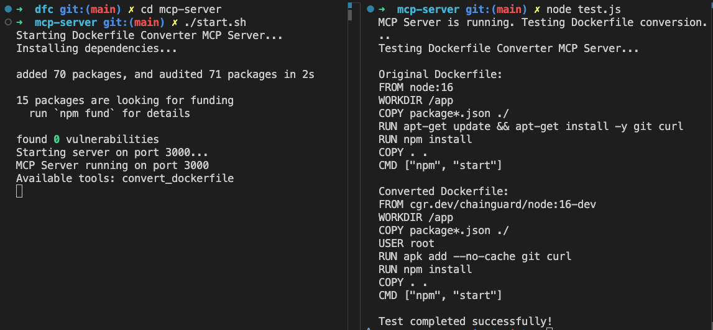

# Dockerfile Converter MCP Server

An MCP server that converts Dockerfiles to use Chainguard Images and APKs.



## Features

- Converts FROM lines to use Chainguard Images
- Converts package manager commands to use APK
- Converts user/group management commands to Alpine format
- Handles multi-stage builds appropriately

## Installation

```bash
# Clone the repository
cd mcp-server

# Install dependencies
npm install
```

## Usage

Start the server:

```bash
npm start
```

The server will start on port 3000 by default. You can change the port by setting the `PORT` environment variable.

### API Endpoints

#### List Available Tools

```
GET /api/tools
```

Returns a list of all available tools in the MCP server.

#### Convert Dockerfile

```
POST /api/tools/convert_dockerfile
```

Request body:

```json
{
  "dockerfile_content": "FROM node:16\nRUN apt-get update && apt-get install -y curl git",
  "organization": "chainguard", 
  "registry": "cgr.dev"
}
```

Parameters:
- `dockerfile_content` (required): The content of the Dockerfile to convert
- `organization` (optional): The Chainguard organization to use (defaults to 'ORG')
- `registry` (optional): Alternative registry to use instead of cgr.dev

Response:

```json
{
  "content": [
    {
      "type": "text",
      "text": "FROM cgr.dev/chainguard/node:16\nUSER root\nRUN apk add --no-cache curl git"
    }
  ]
}
```

## Examples

### Converting a Node.js Dockerfile

Original:
```dockerfile
FROM node:16
WORKDIR /app
COPY package*.json ./
RUN apt-get update && apt-get install -y git
RUN npm install
COPY . .
CMD ["npm", "start"]
```

Converted:
```dockerfile
FROM cgr.dev/ORG/node:16
WORKDIR /app
COPY package*.json ./
USER root
RUN apk add --no-cache git
RUN npm install
COPY . .
CMD ["npm", "start"]
```

### Converting a Multi-stage Dockerfile

Original:
```dockerfile
FROM golang:1.18 AS builder
WORKDIR /app
COPY . .
RUN go build -o myapp

FROM ubuntu:20.04
RUN apt-get update && apt-get install -y ca-certificates
COPY --from=builder /app/myapp /usr/local/bin/
CMD ["myapp"]
```

Converted:
```dockerfile
FROM cgr.dev/ORG/go:1.18-dev AS builder
WORKDIR /app
COPY . .
RUN go build -o myapp

FROM cgr.dev/ORG/chainguard-base:latest
USER root
RUN apk add --no-cache ca-certificates
COPY --from=builder /app/myapp /usr/local/bin/
CMD ["myapp"]
```